# [WE LOVE STEAK](https://ben1998-hub.github.io/We-Love-Steak)

🛑🛑🛑🛑🛑 We Love Steak 🛑🛑🛑🛑🛑
Welcome to "We Love Steak"-a culinary adventure where passion for steak meats the wonders of technology. This project is an homeage to one of the world's most belvoed foods, aiming to bring together steak enthusiasts and culinary experts alike. Here, we delve
into the art and science of preparing, cooking and enjoying steak in all it glory. 

At the heart of "We Love Steak", we are creating a vibrant community platform where steak lovers can share recipes, cooking techiques, and personal experiences. Whether you're a professional chef or a home cook, our project We Love Steak is designed to cater to all levels of expertise.

Our goal is to not just celebrate the culinary aspect of steak but to also integrate technological advancements that enhance our cooking 
tools to leveraging data for perfecting steak preparation, "We Love Steak" is at the forefront of culinary innovation.

Why "We Love Steak"? Because we believe that a grate steak is more then just a meal; it's an experience that brings people together.
It's  about joy of cooking, the memories. Our project is a tribute to this experience, and we invite you to be a part of it.

Here at We Love Steak we are betering are self by teaching others on how to perfected there steaks and allow others to teach us for any new ways that we don't already know about. At We Love Steak it is an amazing place to come and dine or learn and teach everything steak.


https://ui.dev/amiresponsive?url=https://ben1998-hub.github.io/We-Love-Steak

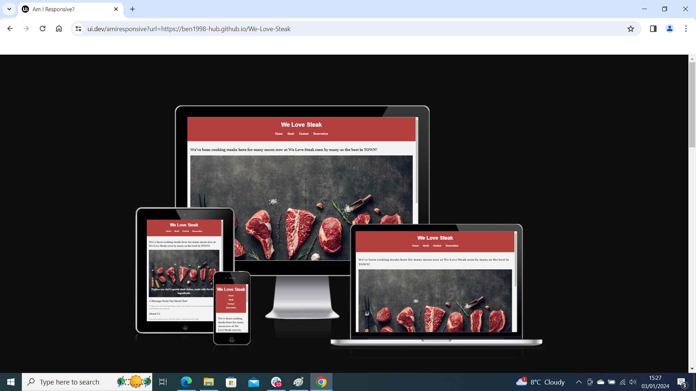


Note: Markdown files (.md) should not contain HTML elements like `img`, `br`, `div`, `a`, etc, only Markdown formatting.
Find out more about using Markdown elements here:
https://pandao.github.io/editor.md/en.html
🛑🛑🛑🛑🛑🛑🛑🛑🛑🛑


## UX

🛑🛑🛑🛑🛑  🛑🛑🛑🛑🛑
## The desgin process 
Design process for We Love Steak is ablend of creativity, strategy, and technology. Here's a breakdown of how we turn juicy ideas into sizzling desings!

## Empathize
**Understanding the users**: I started by immersing myself in the world of steak to understand the user desires, needs and challenges in getting a good steak.


🛑🛑🛑🛑🛑  🛑🛑🛑🛑🛑

### Colour Scheme
The color scheme for We Love Steak. Features black, red, dark gray, and blue. This palette was chosen to crate a visually striking and engaging experience.black offers a classic,readdable base, while the vibrant red serves as a bold highlight, drawing attention to key elements. Dark gray provides a soft contrast for secondary information, and blue adds a cool, refreshing tone. Together, these colors balance virancy with visual appeal of We Love Steak. 

🛑🛑🛑🛑🛑 🛑🛑🛑🛑🛑
## colour's used
- `#000000` used for primary text.
- `#E84610` used for primary highlights.
- `#4A4A4F` used for secondary text.
- `#009FE3` used for secondary highlights.

🛑🛑🛑🛑🛑  🛑🛑🛑🛑🛑
## veiw colour's
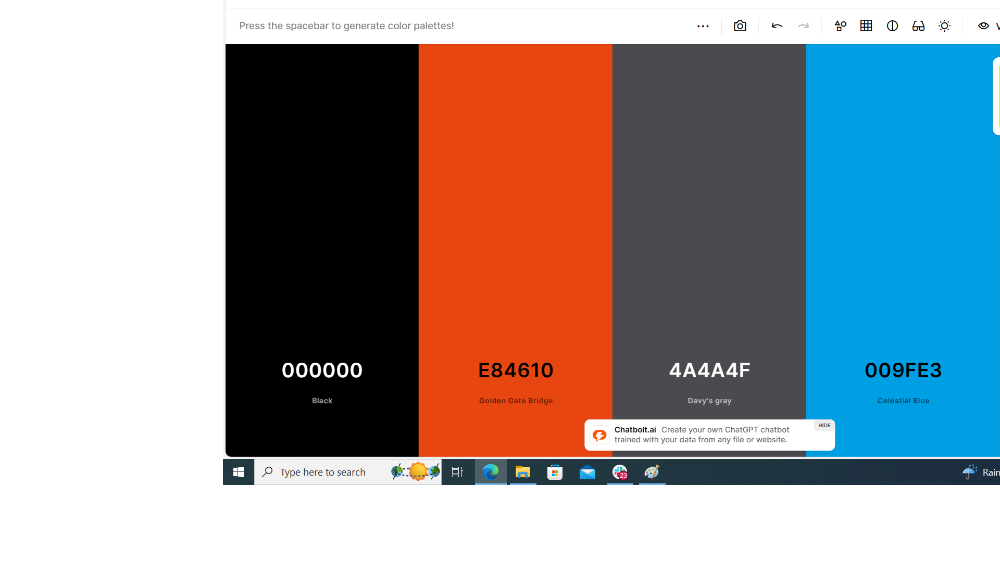


🛑🛑🛑🛑🛑 🛑🛑🛑🛑🛑


I've used CSS `:root` variables to easily update the global colour scheme by changing only one value, instead of everywhere in the CSS file.

```css
:root {
    /* P =Primary | S =Secondary */
    --p-text: #000000;
    --p-highlight: #E84610;
    --s-text: #4A4A4F;
    --s-highlight: #009FE3;
    --white: #FFFFFF;
    --black: #000000;
}
```
🛑🛑🛑🛑🛑🛑🛑🛑🛑🛑
### Typography


- [Montserrat](https://fonts.google.com/specimen/Montserrat) was used for the primary headers and titles.

- [Lato](https://fonts.google.com/specimen/Lato) was used for all other secondary text.

- [Font Awesome](https://fontawesome.com) icons were used throughout the site, such as the social media icons in the footer.
🛑🛑🛑🛑🛑  🛑🛑🛑🛑🛑
## Features
We Love Steak is designed for steaks lovers and restaurant-goers who seek a seamless online experience.It features a user-friendly menu display, reservation system, and informative content about steak varieties, aimed at enhancing customer satisfaction and streamling the dining process. The project prioritizes ease of use and informative value, making it a comprehensive tool for those interested in steak cuisine. 

🛑🛑🛑🛑🛑 END OF NOTES (to be deleted) 🛑🛑🛑🛑🛑

### Existing Features
The display menu for We Love Steak is easy to locate and very easy to use it, it's simple and user frendly and allows accesibility through out the website.

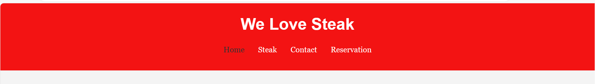

- **Resrvation system #2**

    The resrvation system for We Love Steak is phenomenal with inputs for email, mobile, telephone, time and how many no. of pepole. This allows for an indepth and accurate form/reservation.

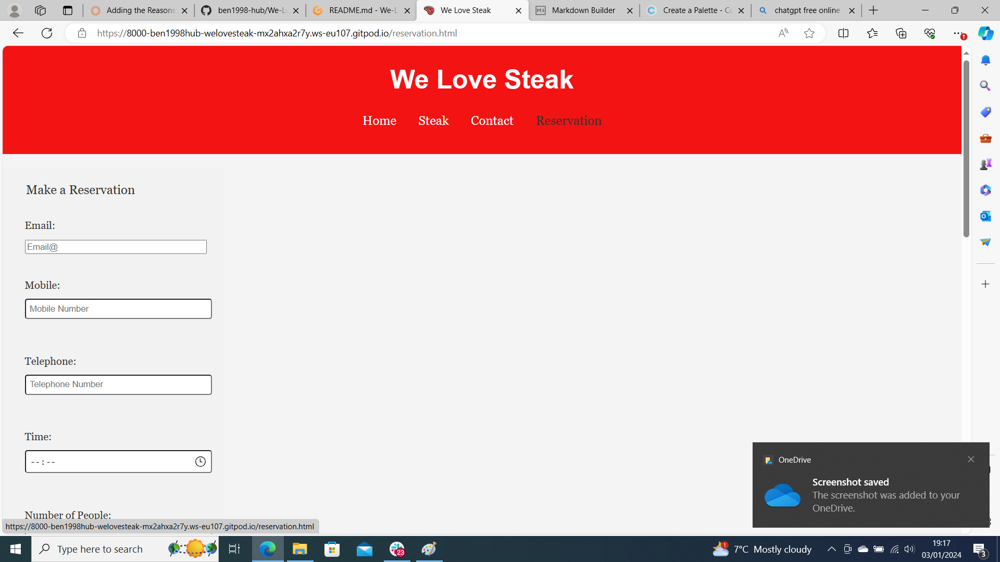

- **Contact #3**

    The contact feature in We Love Steak is exponential critical to it's users so they can locate where we are and how to get to us and how to follow are journey through are social medias. 

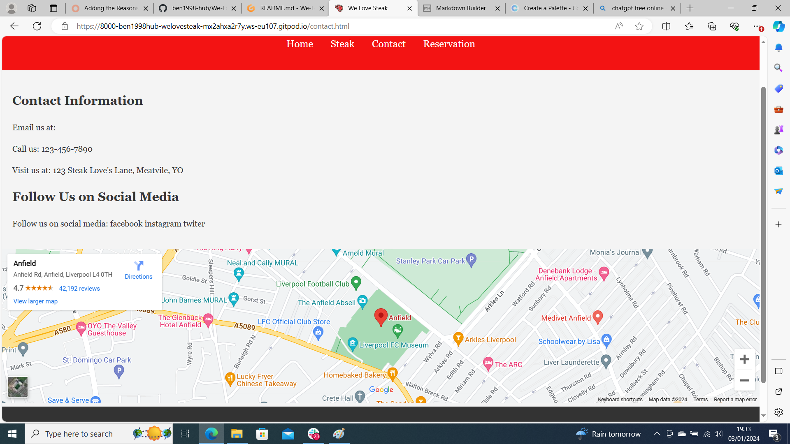

-**steak #3**
The steak feature in We Love Steak is important to are users who dont't know what  stakes to have or how to have them cooked, it allows are customers to be more decisive and find it easier to find the steak they want and how to have it cook.
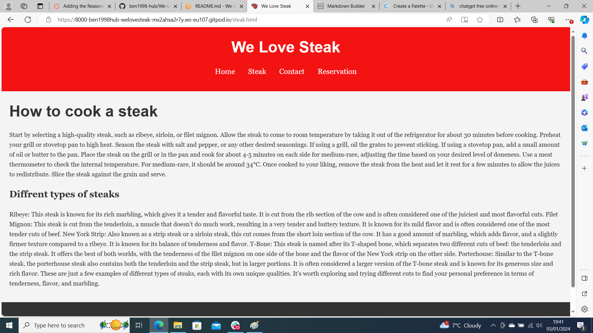

🛑🛑🛑🛑🛑 🛑🛑🛑🛑🛑


### Future Features

-Full menu.
-Somewhere to leave Reviews.
-Shop


- menu #1
    - This future feature is to show are users what we can serve and supply to are users.
- Leave a reviews #2
    - This future feature is to show are users that they have a voice and show them how trusted we are.
- Shop #3
    - This future feature allows are users to  access and buy are equipment.

🛑🛑🛑🛑🛑🛑🛑🛑🛑🛑
## Tools & Technologies Used

-(https://www.youtube.com/watch?v=PlxWf493en4) hlep me with building a basic html website.

-(https://www.youtube.com/watch?v=wRNinF7YQqQ) help me with stlying the html

-(https://www.youtube.com/watch?v=mFFXuXjVgkU) help me with github

-(https://www.youtube.com/watch?v=6rmVkmiKvds) used for ideas into making the website


🛑🛑🛑🛑🛑🛑🛑🛑🛑🛑
## Testing

For all testing, please refer to the [TESTING.md](TESTING.md) file.

## Deployment

The site was deployed to GitHub Pages. The steps to deploy are as follows:

- In the [GitHub repository](https://github.com/ben1998-hub/We-Love-Steak), navigate to the Settings tab 
- From the source section drop-down menu, select the **Main** Branch, then click "Save".
- The page will be automatically refreshed with a detailed ribbon display to indicate the successful deployment.

The live link can be found [here](https://ben1998-hub.github.io/We-Love-Steak)

### Local Deployment

This project can be cloned or forked in order to make a local copy on your own system.

#### Cloning

You can clone the repository by following these steps:

1. Go to the [GitHub repository](https://github.com/ben1998-hub/We-Love-Steak) 
2. Locate the Code button above the list of files and click it 
3. Select if you prefer to clone using HTTPS, SSH, or GitHub CLI and click the copy button to copy the URL to your clipboard
4. Open Git Bash or Terminal
5. Change the current working directory to the one where you want the cloned directory
6. In your IDE Terminal, type the following command to clone my repository:
	- `git clone https://github.com/ben1998-hub/We-Love-Steak.git`
7. Press Enter to create your local clone.

Alternatively, if using Gitpod, you can click below to create your own workspace using this repository.

[](https://gitpod.io/#https://github.com/ben1998-hub/We-Love-Steak)

Please note that in order to directly open the project in Gitpod, you need to have the browser extension installed.
A tutorial on how to do that can be found [here](https://www.gitpod.io/docs/configure/user-settings/browser-extension).

#### Forking

By forking the GitHub Repository, we make a copy of the original repository on our GitHub account to view and/or make changes without affecting the original owner's repository.
You can fork this repository by using the following steps:

1. Log in to GitHub and locate the [GitHub Repository](https://github.com/ben1998-hub/We-Love-Steak)
2. At the top of the Repository (not top of page) just above the "Settings" Button on the menu, locate the "Fork" Button.
3. Once clicked, you should now have a copy of the original repository in your own GitHub account!
🛑🛑🛑🛑🛑🛑🛑🛑🛑🛑


## Credits


-(https://www.youtube.com/watch?v=PlxWf493en4) hlep me with building a basic html website.

-(https://www.youtube.com/watch?v=wRNinF7YQqQ) help me with stlying the html

-(https://www.youtube.com/watch?v=mFFXuXjVgkU) help me with github

-(https://www.youtube.com/watch?v=6rmVkmiKvds) used for ideas into making the website


🛑🛑🛑🛑🛑 🛑🛑🛑🛑🛑

### Content

| Source | Location | Notes |
| --- | --- | --- |
| [Markdown Builder](https://tim.2bn.dev/markdown-builder) | README and TESTING | tool to help generate the Markdown files |
| [Chris Beams](https://chris.beams.io/posts/git-commit) | version control | "How to Write a Git Commit Message" |
| [W3Schools](https://www.w3schools.com/howto/howto_js_topnav_responsive.asp) | entire site | responsive HTML/CSS/JS navbar |
| [W3Schools](https://www.w3schools.com/howto/howto_css_modals.asp) | contact page | interactive pop-up (modal) 
| [Flexbox Froggy](https://flexboxfroggy.com/) | entire site | modern responsive layouts |


### Media

🛑🛑🛑🛑🛑 START OF NOTES (to be deleted) 🛑🛑🛑🛑🛑

Use this space to provide attribution links to any images, videos, or audio files borrowed from online.
A few examples have been provided below to give you some ideas.

If you're the owner (or a close acquaintance) of all media files, then make sure to specify this.
Let the assessors know that you have explicit rights to use the media files within your project.

Ideally, you should provide an actual link to every media file used, not just a generic link to the main site!
The list below is by no means exhaustive. Within the Code Institute Slack community, you can find more "free media" links
by sending yourself the following command: `!freemedia`.

🛑🛑🛑🛑🛑🛑🛑🛑🛑🛑

| Source | Location | Type | Notes |
| --- | --- | --- | --- |
| [Pexels](https://www.pexels.com) | entire site | image | favicon on all pages |
| [Lorem Picsum](https://picsum.photos) | home page | image | hero image background |
| [Unsplash](https://unsplash.com) | product page | image | sample of fake products |
| [Pixabay](https://pixabay.com) | gallery page | image | group of photos for gallery 

🛑🛑🛑🛑🛑🛑🛑🛑🛑🛑

### Acknowledgements


- I would like to thank my Code Institute mentor, [Tim Nelson](https://github.com/TravelTimN) for their support throughout the development of this project.
- I would like to thank the [Code Institute](https://codeinstitute.net) tutor team for their assistance with troubleshooting and debugging some project issues.
- I would like to thank the [Code Institute Slack community](https://code-institute-room.slack.com) for the moral support; it kept me going during periods of self doubt and imposter syndrome.
- I would like to thank my brother(Tomas), for believing in me, and allowing me to make this transition into software development.
- I would like to thank my employer, for supporting me in my career development change towards becoming a software developer.

🛑🛑🛑🛑🛑🛑🛑🛑🛑🛑
# Testing


## Code Validation


### HTML

I have used the recommended [HTML W3C Validator](https://validator.w3.org) to validate all of my HTML files.


Sample HTML code validation documentation (tables are extremely helpful!):

🛑🛑🛑🛑🛑 END OF NOTES (to be deleted) 🛑🛑🛑🛑🛑

| Page | W3C URL | Screenshot | Notes |
| --- | --- | --- | --- |
| Home/index.html | [W3C](https://validator.w3.org/nu/?doc=https%3A%2F%2Fben1998-hub.github.io%2FWe-Love-Steak%2Findex.html) | 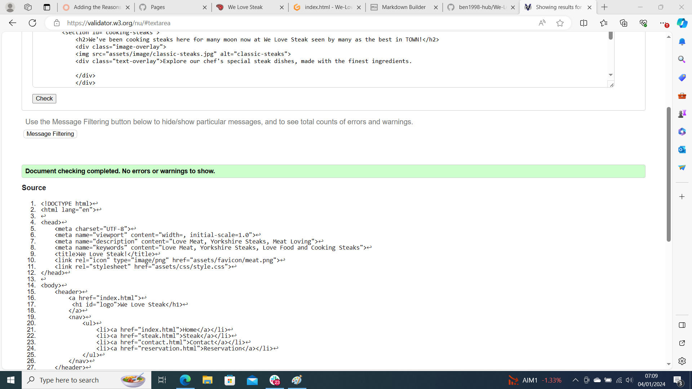 | Pass:No Erorrs|
| Contact.html | [W3C](https://validator.w3.org/nu/?doc=https%3A%2F%2Fben1998-hub.github.io%2FWe-Love-Steak%2Fcontact.html) |  | obsolete iframe warnings,fixed |
| reservation.html | [W3C](https://validator.w3.org/nu/?doc=https%3A%2F%2Fben1998-hub.github.io%2FWe-Love-Steak%2Fquiz.html) |  | Pass: No Errors |
| steak.html | [W3C] | 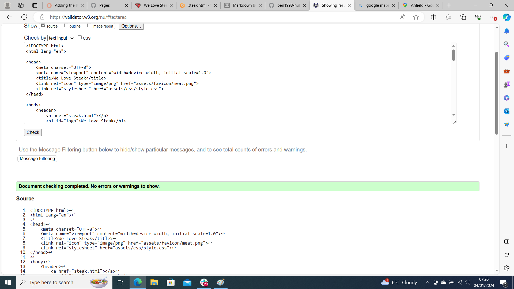 | Duplicate IDs found, and fixed |
|
🛑🛑🛑🛑🛑🛑🛑🛑🛑🛑

### CSS

I have used the recommended [CSS Jigsaw Validator](https://jigsaw.w3.org/css-validator) to validate all of my CSS files.


🛑🛑🛑🛑🛑🛑🛑🛑🛑🛑


## Browser Compatibility


I've tested my deployed project on multiple browsers to check for compatibility issues.

| Browser | Home | About | Contact | etc | Notes |
| --- | --- | --- | --- | --- | --- |
| Chrome |  |  |  |  | Works as expected |
| Edge |  |  |  |  | Works as expected |
| Brave |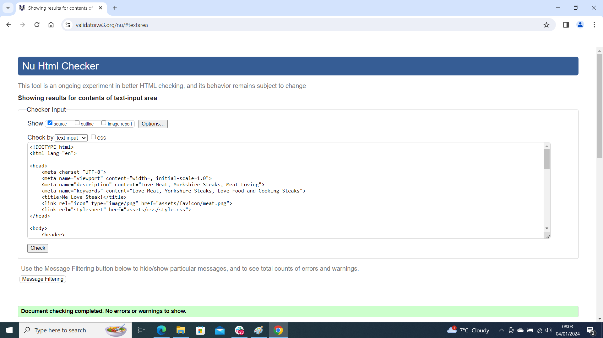 |  | 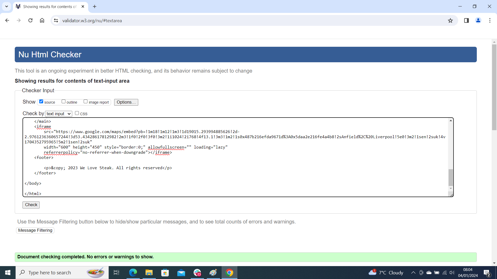 | 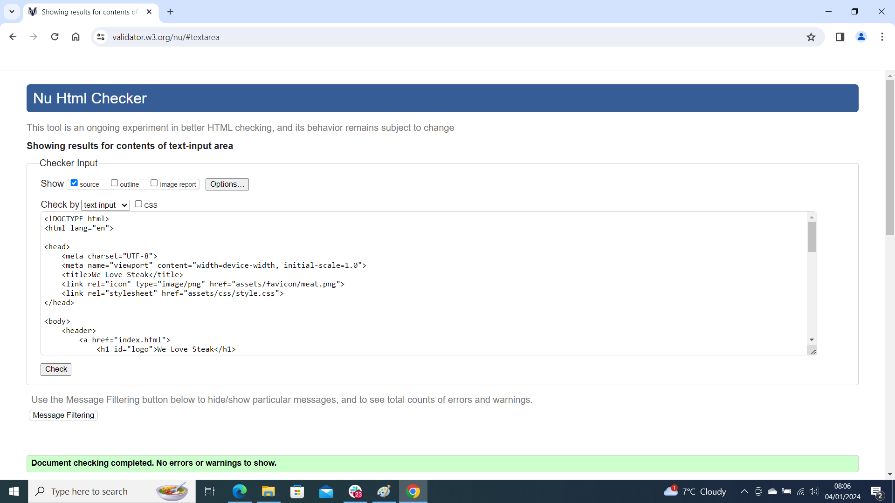 | Works as expected |

🛑🛑🛑🛑🛑🛑🛑🛑🛑🛑


## Responsiveness


I've tested my deployed project on multiple devices to check for responsiveness issues.

| Device | Home | About | Contact | etc | Notes |
| --- | --- | --- | --- | --- | --- |
| Mobile (DevTools) | 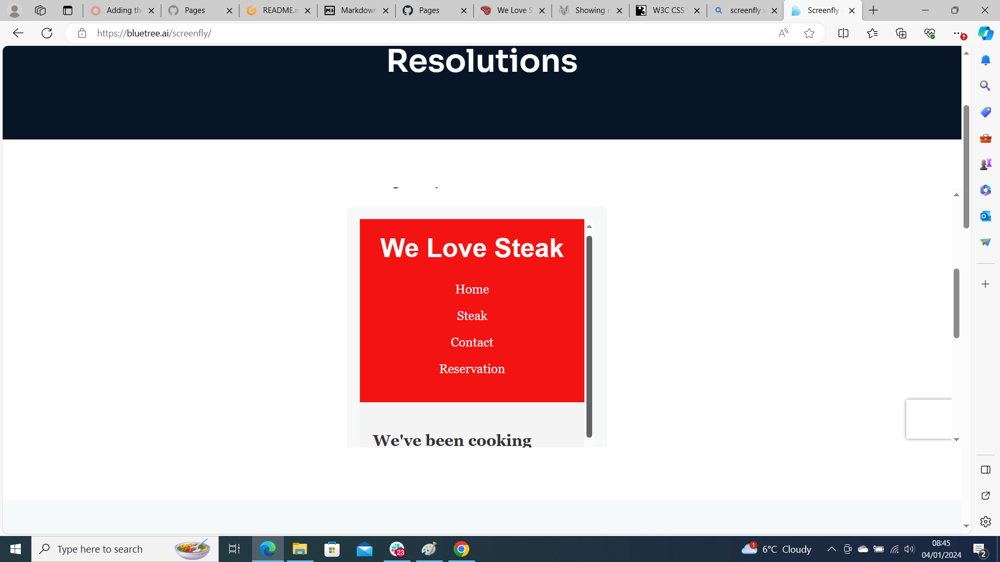 |  |  | 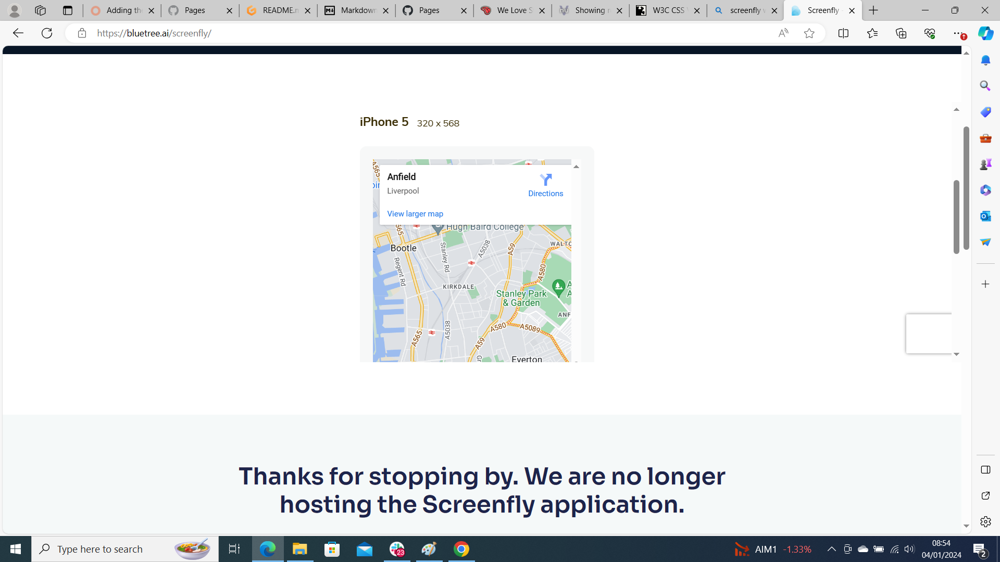 | Works as expected |
| Tablet (DevTools) |  | 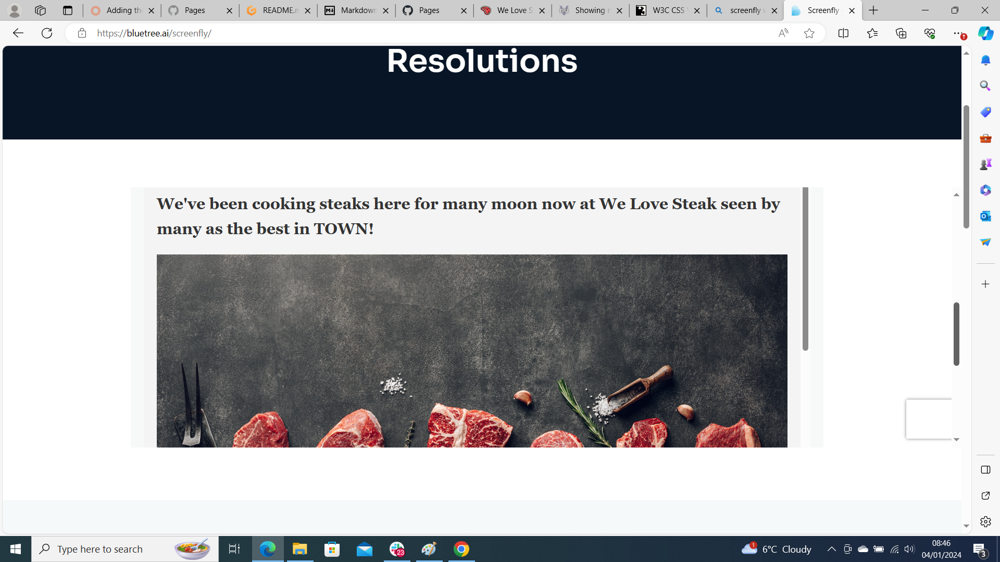 | 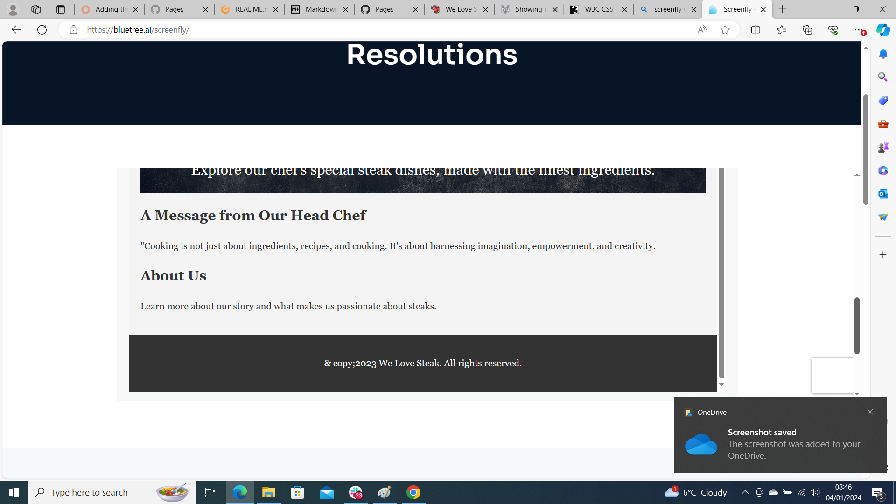 | 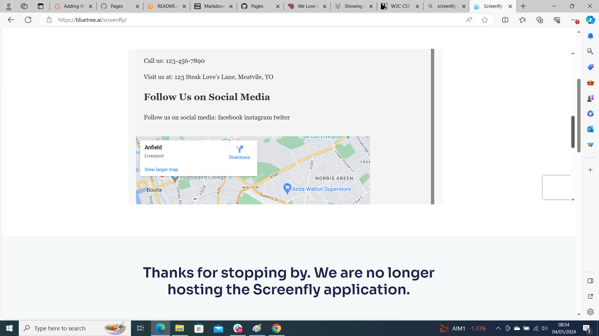 | Works as expected |
| Desktop | 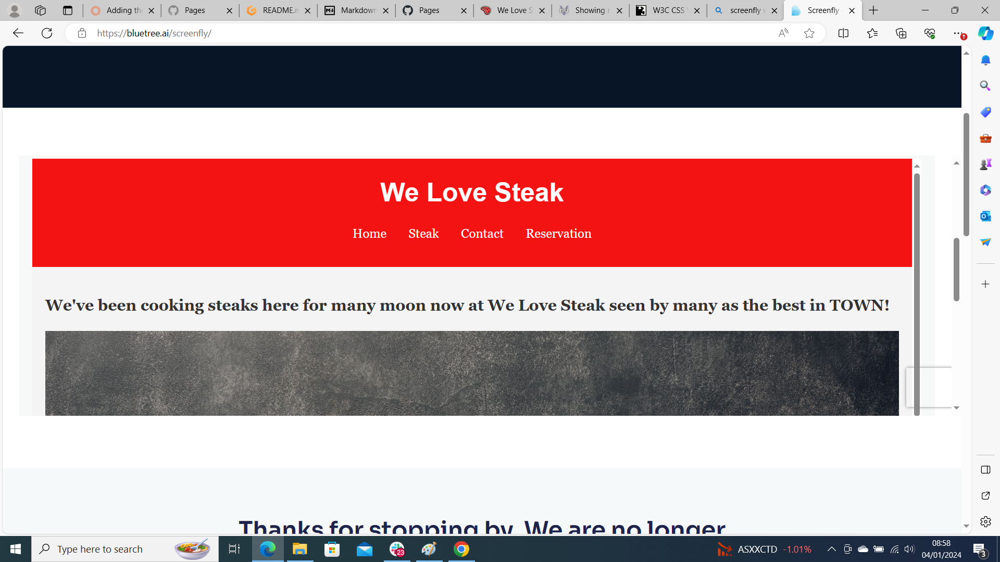 | 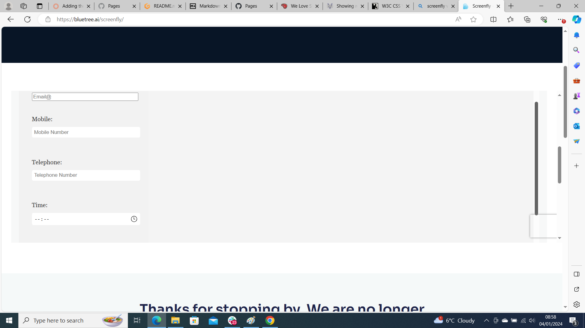 | 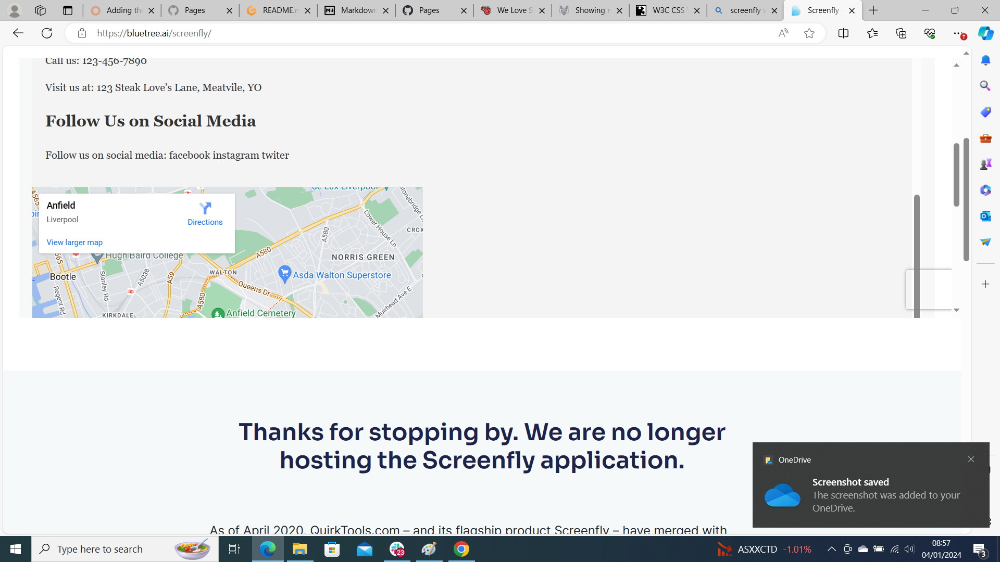 | 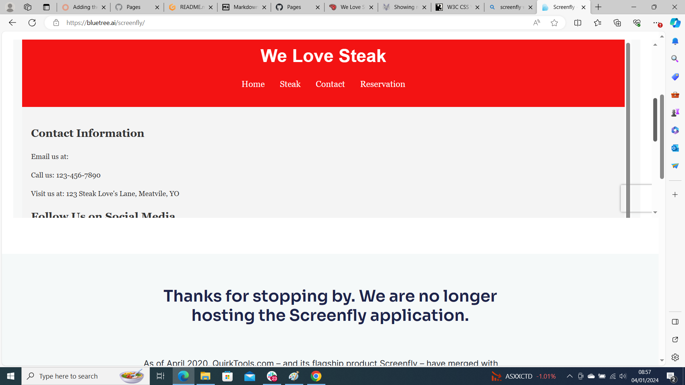 | Works as expected |

🛑🛑🛑🛑🛑🛑🛑🛑🛑🛑

## screenfly


I've tested my deployed project using the Lighthouse Audit tool to check for any major issues.

|Mobile | Desktop | Notes |
|
|
|
## Bugs

🛑🛑🛑🛑🛑 START OF NOTES (to be deleted) 🛑🛑🛑🛑🛑

This section is primarily used for JavaScript and Python applications,
but feel free to use this section to document any HTML/CSS bugs you might run into.

It's very important to document any bugs you've discovered while developing the project.
Make sure to include any necessary steps you've implemented to fix the bug(s) as well.

**PRO TIP**: screenshots of bugs are extremely helpful, and go a long way!

🛑🛑🛑🛑🛑 END OF NOTES (to be deleted) 🛑🛑🛑🛑🛑

- JS Uncaught ReferenceError: `foobar` is undefined/not defined

    

    - To fix this, I _____________________.


## Unfixed Bugs

🛑🛑🛑🛑🛑 START OF NOTES (to be deleted) 🛑🛑🛑🛑🛑

You will need to mention unfixed bugs and why they were not fixed.
This section should include shortcomings of the frameworks or technologies used.
Although time can be a big variable to consider, paucity of time and difficulty understanding
implementation is not a valid reason to leave bugs unfixed.

If you've identified any unfixed bugs, no matter how small, be sure to list them here.
It's better to be honest and list them, because if it's not documented and an assessor finds the issue,
they need to know whether or not you're aware of them as well, and why you've not corrected/fixed them.

Some examples:

🛑🛑🛑🛑🛑 END OF NOTES (to be deleted) 🛑🛑🛑🛑🛑

- On devices smaller than 375px, the page starts to have `overflow-x` scrolling.

    

    - Attempted fix: I tried to add additional media queries to handle this, but things started becoming too small to read.

- For PP3, when using a helper `clear()` function, any text above the height of the terminal does not clear, and remains when you scroll up.

    

    - Attempted fix: I tried to adjust the terminal size, but it only resizes the actual terminal, not the allowable area for text.

- When validating HTML with a semantic `section` element, the validator warns about lacking a header `h2-h6`. This is acceptable.

    

    - Attempted fix: this is a known warning and acceptable, and my section doesn't require a header since it's dynamically added via JS.

🛑🛑🛑🛑🛑 START OF NOTES (to be deleted) 🛑🛑🛑🛑🛑

If you legitimately cannot find any unfixed bugs or warnings, then use the following sentence:

🛑🛑🛑🛑🛑 END OF NOTES (to be deleted) 🛑🛑🛑🛑🛑

There are no remaining bugs that I am aware of.
