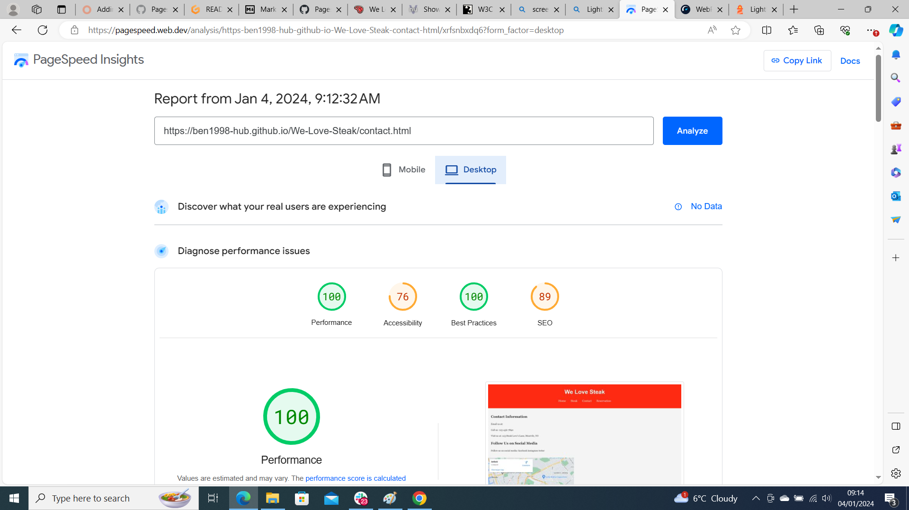

# Testing

Return back to the [README.md](README.md) file.

## Code Validation
### HTML

I have used the recommended [HTML W3C Validator](https://validator.w3.org) to validate all of my HTML files.

Sample HTML code validation documentation (tables are extremely helpful!):

| Page | W3C URL | Screenshot | Notes |
| --- | --- | --- | --- |
| Home/index.html | [W3C](https://validator.w3.org/nu/?doc=https%3A%2F%2Fben1998-hub.github.io%2FWe-Love-Steak%2Findex.html) |  | Pass:No Erorrs|
| Contact.html | [W3C](https://validator.w3.org/nu/?doc=https%3A%2F%2Fben1998-hub.github.io%2FWe-Love-Steak%2Fcontact.html) |  | obsolete iframe warnings,fixed |
| reservation.html | [W3C](https://validator.w3.org/nu/?doc=https%3A%2F%2Fben1998-hub.github.io%2FWe-Love-Steak%2Fquiz.html) |  | Pass: No Errors |
| steak.html | [W3C] |  | Duplicate IDs found, and fixed |
|

### CSS

I have used the recommended [CSS Jigsaw Validator](https://jigsaw.w3.org/css-validator) to validate all of my CSS files.

## Browser Compatibility

I've tested my deployed project on multiple browsers to check for compatibility issues.

| Browser | Home | About | Contact | etc | Notes |
| --- | --- | --- | --- | --- | --- |
| Chrome |  |  |  |  | Works as expected |
| Edge |  |  |  |  | Works as expected |
| Brave | |  |  |  | Works as expected |

## Responsiveness

I've tested my deployed project on multiple devices to check for responsiveness issues.

| Device | Home | About | Contact | etc | Notes |
| --- | --- | --- | --- | --- | --- |
| Mobile (DevTools) |  |  |  |  | Works as expected |
| Tablet (DevTools) |  |  |  |  | Works as expected |
| Desktop |  |  |  |  | Works as expected |

## screenfly

I've tested my deployed project using the Lighthouse Audit tool to check for any major issues.

|Mobile | Desktop | Notes |
|
|
|

## Bugs
There are no bugs that I am aware of.

## Unfixed Bugs

There are no remaining bugs that I am aware of.

